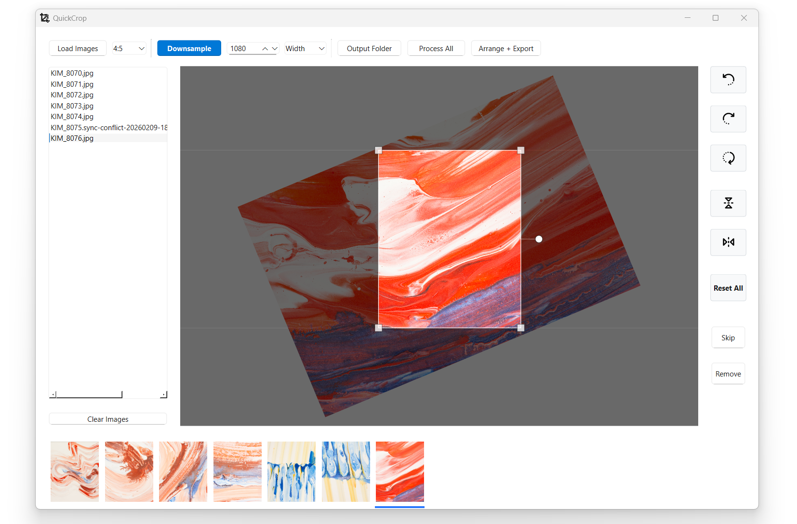

# QuickCrop

QuickCrop is a desktop tool for preparing images for social media. It provides interactive cropping, batch processing, and organization features.



## Features

- **Interactive Cropping**: Adjust crop areas with real-time feedback. Supports 1:1, 4:5, 9:16, 4:3, and 3:4 ratios.
- **Preview Mode**: View the final cropped result instantly (masked view).
- **Arrange Mode**: A grid view to reorder images via drag-and-drop, review batch thumbnails, and bulk rename files.
- **Image Transformations**: Rotate and mirror images.
- **Batch Export**: Process multiple images at once to a selected output folder.
- **Downsampling**: Optionally resize images to a target resolution during export.
- **Performance**: Background image loading and caching for smooth navigation.

## Usage

1. Click **Load Images** and select one or more files (`.jpg`, `.jpeg`, `.png`, `.tif`, `.tiff`).
2. Navigate with `Left` / `Right` (or `J` / `K`), by clicking items in the list/camera roll, or by clicking near the left/right edge of the large preview.
3. Press `Space` (or double-click inside the crop area) to switch between **Edit** and **Preview**. In Edit mode, move/resize the crop, rotate, mirror, or skip images (`Up` / `I`, **Skip**, or double-click in camera roll).
4. Set **Output Folder** (required), then export:
   - **Process All**: exports all non-skipped images.
   - **Arrange + Export**: reorder by drag-and-drop, optionally enable **Rename**, then click **Export**.

## Keyboard Shortcuts

| Key | Action |
| :--- | :--- |
| `Left` / `Right` or `J` / `K` | Navigate between images |
| `Space` | Toggle Edit/Preview mode |
| `Up` / `I` | Toggle "Skip" status (image will not be exported) |
| `L` | Reset crop to default |
| `Backspace` / `O` | Remove image from the current list |

## Installation

### Using [uv](https://github.com/astral-sh/uv) (Recommended)

```bash
uv run main.py
```

### Using pip

```bash
# Install dependencies
pip install -r requirements.txt

# Run the application
python main.py
```

## Distribution

To build a standalone executable:

```bash
uv run python build.py
```

Outputs are located in the `dist/` directory.

## License

- **Quick Crop**: Licensed under the [PolyForm Shield License 1.0.0](https://polyformproject.org/licenses/shield/1.0.0). This license allows commercial use but prohibits reselling or competing products.
- **Dependencies**: 
    - **PySide6**: Licensed under [LGPL v3](https://www.gnu.org/licenses/lgpl-3.0.html).
    - **Pillow**: Licensed under [HPND](https://github.com/python-pillow/Pillow/blob/main/LICENSE).
